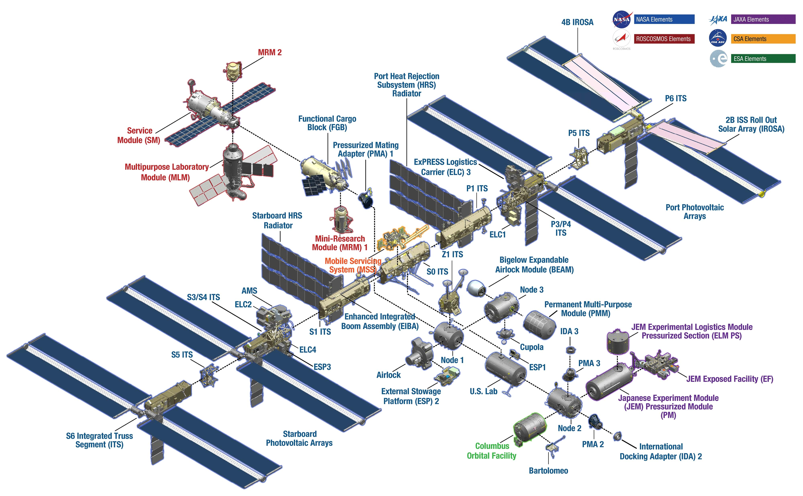
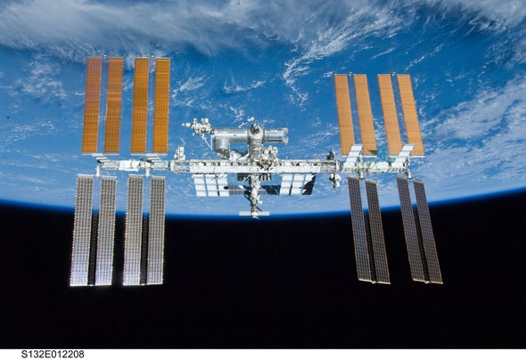
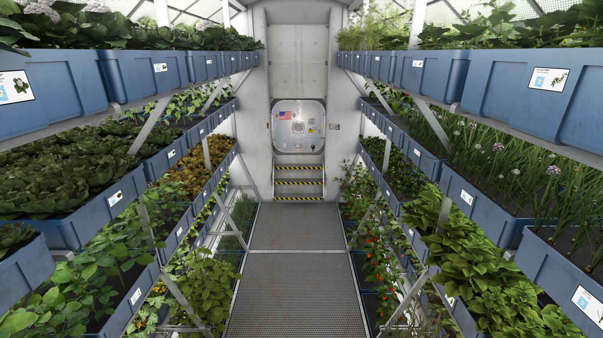

# Space Exploration

## International Space Station (ISS)

The International Space Station, or ISS, resides in low-Earth orbit and is operated by five space agencies:
- National Aeronautics and Space Administration (United States)
- Canadian Space Agency (Canada)
-	European Space Agency (Europe)
-	Roscosmos (Russia)
- Japan Aerospace Exploration Agency (Japan)

The abbreviations for each space agency if applicable, are NASA, CSA, ESA, Roscosmos, and JAXA.

The project for the ISS began on January 25, 1986, and the first segment was sent on November 20, 1998. After two years, astronaut Bill Shepherd and cosmonauts Yuri Gidzenko and Sergei Krikalev, inhabited the station on November 2, 2000; being the first group of people to be on the ISS.

**Figure 3-1** A map of the International Space Station and which countries control which portions of the station.

### Robotics on the ISS
:::caution

Canadarm, Canadarm2, and Canadarm3 are successors of one another. They are not the same.

:::

Although Canada made significant contributions to space technology, for example the Canadarm. The United States was its main operator, and it was only solely for space shuttles until the ISS was built. 

Compared to Canadarm2, it did not have haptic feedback or a collision system and was limited to a 160-degree elbow rotation. There were two cameras which provided vision for the cabin and the arm was 15 metres in length. It was retired as of July 2011, and its successor, Canadarm2 now resides in the ISS.

Canadarm2 was sent to the ISS on April 19, 2001 and was a big step in the evolution of space technology. Both astronauts on the ISS and people down at ground control had access to the arm and there was also a collision system with haptic feedback. Unlike the first arm, Canadarm2 was controlled by both Canada and the United States. Currently in development is Canadarm3–which will be a fully autonomous, artificial intelligence powered robot at the Lunar Gateway, but to this day, the most sophisticated space robot ever built, is Dextre.

Dextre, short for the Special Purpose Dexterous Manipulator (SPDM), has been serving the ISS since 2008. It performs maintenance work such as charging batteries or replacing cameras. The robot was launched aboard the Space Shuttle Endeavor. Five days later, NASA astronauts Richard Linnehan and Mike Foreman installed it. The robot has the ability to repair itself, and reduces the risks associated to space walks for astronauts.

Since 2013, Dextre and Canadarm2 have been printed on the $5 polymer banknotes, highlighting the achievements that Canada have made in space exploration. The materials for Canada’s space projects are supplied by over 500 organizations across Canada, including **MDA** which assembled, built, and delivered a large portion of the parts to the ISS.

  
Comparative Table of the Canadarms

<table>
<thead>
<tr>
<th></th>
<th>Canadarm</th>
<th>Canadarm2</th>
<th>Canadarm3</th>
</tr>
</thead>
<tbody>
<tr>
<td><strong>Location</strong></td>
<td>Installed on each Space Shuttle and returned to Earth.  Now retired, the Canadarm is on display at the <a href="https://ingeniumcanada.org/aviation/whats-on/exhibition-legacy-of-the-canadarm.php" target="_blank">Canada Aviation and Space Museum</a> in Ottawa, Ontario.</td>
<td>Stays permanently in space on board the <a href="https://www.asc-csa.gc.ca/eng/iss/default.asp" target="_blank">International Space Station</a>.</td>
<td>Will stay permanently in space on board the <a href="http://csa-asc.gc.ca/eng/astronomy/moon-exploration/lunar-gateway.asp" target="_blank">Lunar Gateway</a>.</td>
</tr>
<tr>
<td><strong>Range of Motion</strong></td>
<td>Reach limited to length of arm.</td>
<td>Moves end-over-end to reach many parts of the International Space Station, where its anchoring "hand" plugs into a power, data, and video outlet.  Because it is mounted on the Mobile Base, the arm can travel the entire length of the Space Station.</td>
<td>Will move end-over-end to reach many parts of the Lunar Gateway, where its anchoring "hand" will plug into a power, data, and video outlet.  The arm will be able to travel and bring tools to the entire length of the Lunar Gateway.</td>
</tr>
<tr>
<td><strong>Fixed Joint</strong></td>
<td>Fixed to the shuttle by one end.</td>
<td>No fixed end.</td>
<td>No fixed end.</td>
</tr>
<tr>
<td><strong>Degrees of Freedom</strong></td>
<td>Six degrees of freedom. Similar to a human arm: <ul dir="auto"><li>Two joints in the shoulder</li><li>One joint in the elbow</li><li>Three joints in the wrist</li></ul></td>
<td>Seven degrees of freedom. Very similar to a human arm:<ul dir="auto"><li>Three joints in the shoulder</li><li>One joint in the elbow</li><li>Three joints in the wrist</li></ul></td>
<td>Seven degrees of freedom. Very similar to a human arm:<ul dir="auto"><li>Three joints in the shoulder</li><li>One joint in the elbow</li><li>Three joints in the wrist</li></ul></td>
</tr>
<tr>
<td><strong>Joint Rotation</strong></td>
<td>Elbow rotation limited to 160 degrees.</td>
<td>Each of Canadarm2's joints rotate 270 degrees in each direction, a total of 540 degrees.  This range of motion is greater than that of a human arm.</td>
<td>Each joint will be able to rotate almost 360 degrees.</td>
</tr>
<tr>
<td><strong>Senses</strong></td>
<td>No sense of touch.</td>
<td><ul dir="auto"><li>Force-moment sensors provide a sense of "touch".</li><li>Automatic collision avoidance.</li></ul></td>
<td><ul dir="auto"><li>Force-moment sensors provide a sense of "touch".</li><li>Automatic collision avoidance.</li><li>3D Vision Sensor Tool that maps objects around it.</li></ul></td>
</tr>
<tr>
<td><strong>Length</strong></td>
<td>15 m</td>
<td>17 m</td>
<td>8.5 m</td>
</tr>
<tr>
<td><strong>Mass</strong></td>
<td>410 kg</td>
<td>1497 kg</td>
<td>715 kg (estimation)</td>
</tr>
<tr>
<td><strong>Diameter</strong></td>
<td>33 cm (exterior diameter of composite boom)</td>
<td>35 cm (exterior diameter of composite boom)</td>
<td>23 cm (exterior diameter of composite boom)</td>
</tr>
<tr>
<td><strong>Speed of Operation</strong></td>
<td>Unloaded: 60 cm/s Loaded: 6 cm/s</td>
<td>Unloaded: 37 cm/s Loaded:<ul dir="auto"><li>2 cm/s (during ground control)</li><li>15 cm/s (support during <a href="https://www.asc-csa.gc.ca/eng/astronauts/about-the-job/spacewalks.asp" target="_blank">spacewalks</a>)</li></ul></td>
<td>Unloaded: 10 cm/s Loaded: to be determined</td>
</tr>
<tr>
<td><strong>Composition</strong></td>
<td>16 layers of high-modulus carbon fibre epoxy</td>
<td>19 layers of high-strength carbon fibre thermoplastic</td>
<td>Carbon fibre composite.</td>
</tr>
<tr>
<td><strong>Repairs</strong></td>
<td>Repaired on Earth.</td>
<td>Designed to be repaired in space. Composed of removable sections that can be individually replaced in space.</td>
<td>Designed to self-detach sections that can be repaired inside the Lunar Gateway.</td>
</tr>
<tr>
<td><strong>Control</strong></td>
<td>Controlled by astronauts on the Space Shuttle.</td>
<td>Controlled from the ground or by astronauts on the International Space Station.</td>
<td>Primarily controlled autonomously. Can also be controlled from the ground or by astronauts on the Lunar Gateway.</td>
</tr>
<tr>
<td><strong>Cameras</strong></td>
<td>Two cameras: <ul dir="auto"><li>One on the elbow</li><li>One on the wrist</li></ul></td>
<td><a href="http://www.asc-csa.gc.ca/eng/search/images/watch.asp?id=4211" target="_blank">Four colour cameras</a>: <ul dir="auto"><li>One on each side of the elbow</li><li>The other two on the "hands"</li></ul></td>
<td>Six colour 4K cameras: <ul dir="auto"><li>One 360-degree camera on each side of the elbow</li><li>One on each boom on swivel mounts</li><li>The other two on the "hands"</li></ul></td>
</tr>
<tr>
<td><strong>Operator</strong></td>
<td>United States</td>
<td>Canada and United States</td>
<td>Canada</td>
</tr>
</tbody>
</table>

**Figure 3-2** The exterior view of the International Space Station taken in 2010.

### Space Agriculture

In preparation for the trip to Mars, space agencies such as NASA and the Canadian Space Agency have begun developing advanced food production systems. These systems will allow astronauts to grow their own food on year-long space missions. The bioresource engineering department at McGill University helped the Advanced Plant Habitat on the ISS develop dwarf wheat. However, this brings up the risk of radiation as consuming radiated food is a major risk factor for cancer and premature aging. Radiation exposure can also cause mutations in the plants and damage the crops. Fortunately, foods high in antioxidants can mitigate these risks. Most plants we consume are diurnal, meaning they open their flowers during the day. One of the major concerns of agriculture in space is the lack of light. The use of artificial sunlight by LEDs was developed through NASA-funded research. Although LEDs aren’t efficient, they perform well when placed in plant chambers. Plant chambers are only 0.15-square-metres, but these chambers can be upscaled to provide enough food for the round trip to Mars.

**Figure 3-3** Artificial sunlight from LEDs being used on the ISS for plants.

## The Challenger Accident

The Space Shuttle, _Challenger_ was a partially reusable spacecraft operated by the United States equipped with 5 Canadarms. It would undergo 9 missions before it would explode into pieces, killing all 7 crew members onboard. Challenger was planned to study Halley’s Comet and to deploy a communications satellite, but it broke apart after 73 seconds of launch.

The cause of its crash was because of two O-ring seals in the space shuttle’s solid rocket booster (SRC). Pressurized gas burnt through the walls of the external fuel tank, causing a structural failure which led to an explosion. This accident was fatal and caused a 32-month hiatus in the Space Shuttle program. The last words from Michael J. Smith would be the following:

> Uhoh.

Source: [NASA Audio Transcript](https://history.nasa.gov/transcript.html)

## Activities
1.	How does Canada still maintain a supportive role in developmental projects?
2.	What will be the differences between Canadarm 3 and Canadarm 1 and 2?
3.	Why are LEDs being used to grow plants? Could there be any other alternatives?
4.	What is the risk of using LEDs as artificial sunlight in space?
5.	Why is Canadarm 2 and Dextre on the $5 banknotes? Why were these technological advancements so important? 
6.	The Challenger accident was tragic but avoidable. What differences could you make to the shuttle, launch or preparation?
